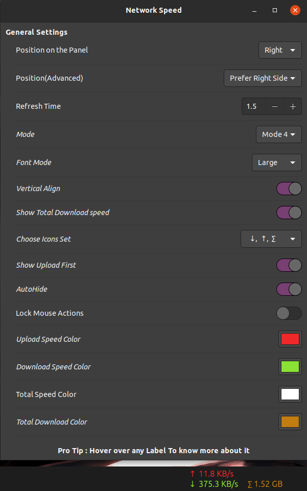

<p align="center"><a href="#"></a></p>
<h1 align="center">Network Speed</h1>
<h5 align="center"><i>Highly customizable Gnome network speed extension</i></h5>

[](#) or [Install Manually](#installing-manually)


<p align="center">

*Screenshot*

**Current Version** : ***1***

### **What's in this extension:** 

* Preference Menu to customize the extension.

* Five configurable network speed modes. 
      
      1) Total net speed in [g, m, k]b/s.
      2) Total net speed in [G, M, K]B/s.
      3) Up and down speed in [g, m, k]b/s.
      4) Up and down speed in [G, M, K]B/s.
      5) Total Downloaded in [G, M, K]B.

* Extension color can be customizable.

* Option to show upload speed first in the modes 3 and 4.

* Align the extension horizantally or vertically.

* Different font sizes.

* Option to autohide the extension, when idle.

### **Mouse click events on the extension:**

* *Left click:* Cycle through the modes.

* *Right click in the first four modes:* Toggle the visibility of total downloaded.

* *Right click in the fifth mode:* Reset total downloaded.

* *Four consecutive right clicks:* Toggle the horizantal/vertical alignment.

* *Middle click:* Cycle through the font sizes.

> Thanks to [bijignome](https://github.com/biji/simplenetspeed) of creating the extension. 

> Special thanks to [prateekmedia](https://github.com/prateekmedia/netspeedsimplified) for giving rebirth to the extension.

**What I added:**

* Revamping the whole codebase to create roadmap for many feature additions.

* Color customizations, Upload speed first, AutoHide.

* Adopted Make build system to manage the extension (for developers).

* Quick install method.

<h2 align="center">Installing Manually:</h2>   

* Please Star this repository and mark it as Watch if you want to know about latest updates.
  
## Quick install
The extension can be quicky installed as following:

    $ /bin/bash -c "$(curl -sL https://git.io/JkFoh)"


## Installing using Make
The Extension can be managed using Make build system as follows

* Getting the sources from repository

      $ git clone https://github.com/m0hithreddy/NetworkSpeeed.git

* Running make (install)

      $ make install

Likewise extension can be removed  
```$ make remove```  
OR reinstalled  
```$ make reinstall```  


You can manage the extension using extensions app or [website](https://extensions.gnome.org/local) or Using Gnome tweaks tool's extension tab  
